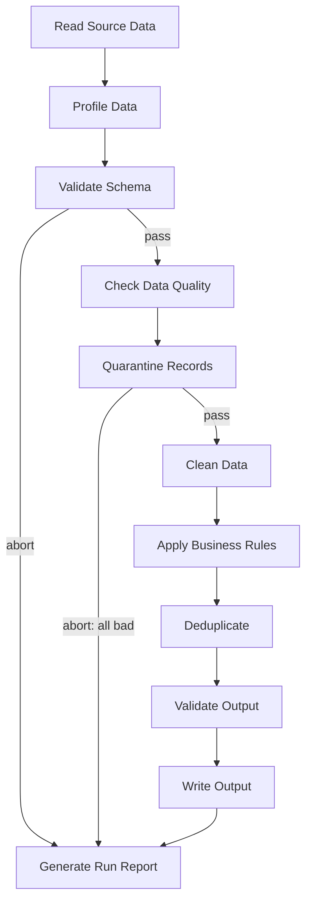

# ETL Genie 🧞

> An agentic AI agent that automates ETL pipelines — extract, validate, quarantine, transform, load, and report — built with LangGraph and Llama 3.1. Fully local, fully open source, zero cost.


---

## What it does

ETL Genie is an AI agent that takes a raw CSV file and autonomously runs it through a complete data engineering pipeline — without writing pipeline-specific code per dataset.

It extracts source data, profiles it, validates schema, detects data quality issues, quarantines bad records with a full audit trail, applies business transformation rules, deduplicates, validates the final output, writes a clean Parquet file, and generates a timestamped run report — all in under 1 second on a CPU-only machine.

## Why it exists

Manual ETL pipelines require constant engineer oversight — checking for nulls, duplicates, schema drift, and writing audit logs by hand. ETL Genie demonstrates that an LLM-orchestrated agent can handle this reliably, locally, and for free, as a foundation for scaling agentic AI across the full data engineering lifecycle.

---

## Architecture

ETL Genie uses a **LangGraph StateGraph** — a deterministic pipeline, not a ReAct loop. Each step is a graph node. The graph enforces execution order; the LLM is available for reasoning within steps but does not control flow. This is intentional — small local models are unreliable at autonomous tool-calling across many steps, and production data pipelines need deterministic, debuggable behaviour regardless of model size.



**Abort conditions** — the agent stops early and jumps straight to the report when:

- Source file not found
- Source file has no data rows
- Schema is too different to process (more than half of expected columns missing)
- All records fail quality checks (nothing left to process)

This means the agent never crashes on bad input — it always produces a clean, readable run report explaining exactly what happened.

---

## Tech stack

| Layer | Technology |
|---|---|
| LLM | Llama 3.1 8B (4-bit quantised) via Ollama — local, free, no API key |
| Agent framework | LangChain + LangGraph (StateGraph) |
| Tool libraries | pandas, DuckDB, pydantic, pyarrow |
| Data I/O | CSV (source) → Parquet (output) + CSV (quarantine) |
| UI | Streamlit |
| Runtime | Python 3.10+, CPU-only, tested on 16 GB RAM |

No cloud account, API key, or paid service required.

---

## Project structure

```
etl-genie/
├── README.md
├── LICENSE
├── requirements.txt
├── .gitignore
├── tools.py        ← 11 tool functions (Extract → Validate → Quarantine → Transform → Load → Report)
├── agent.py        ← LangGraph StateGraph pipeline with abort routing
├── main.py         ← CLI entry point
├── app.py          ← Streamlit dashboard
└── data/
    ├── sales_raw.csv       ← sample dataset with intentional quality issues
    ├── empty.csv           ← edge case: no data rows
    ├── wrong_columns.csv   ← edge case: incompatible schema
    └── all_nulls.csv       ← edge case: every record fails quality checks
```

`output/` and `quarantine/` folders are created automatically on first run and are excluded from version control (see `.gitignore`) since their contents are regenerated every run.

---

## Getting started

### Prerequisites

- Python 3.10+
- [Ollama](https://ollama.com/download) installed and running

### Setup

```bash
# 1. Clone the repo
git clone https://github.com/<your-username>/etl-genie.git
cd etl-genie

# 2. Create and activate a virtual environment
python -m venv venv
venv\Scripts\activate          # Windows
# source venv/bin/activate     # macOS / Linux

# 3. Install dependencies
pip install -r requirements.txt

# 4. Pull the local LLM
ollama pull llama3.1
```

### Run it

```bash
# Run the agent against the sample dataset, print results to terminal
python main.py
```

```bash
# Or launch the browser dashboard
streamlit run app.py
```

The dashboard opens at `http://localhost:8501` with four tabs: live run log, output data preview, quarantine viewer, and a downloadable run report.

---

## Example output

Running against `data/sales_raw.csv` (15 rows, with 2 missing names, 1 missing region, and 1 negative price deliberately included):

```
[Step 1/11] Reading source data...
  → SUCCESS: Loaded 15 rows and 8 columns.
[Step 4/11] Checking data quality...
  → ISSUES FOUND:
      - Column 'customer_name' has 2 null values
      - Column 'region' has 1 null values
      - 1 rows have negative unit_price
[Step 5/11] Quarantining records...
  → Quarantined 4 bad records. 11 clean records remain for processing.
...
[Step 10/11] Writing output...
  → SUCCESS: Written 11 rows to output/sales_clean_<timestamp>.parquet
```

Final run report:

```
==================================================
ETL AGENT RUN REPORT — COMPLETED
==================================================
Rows extracted  : 15
Rows quarantined: 4
Rows loaded     : 11
Issues found    : 3
==================================================
```

---

## Edge cases handled

| Scenario | Behaviour |
|---|---|
| File not found | Aborts at Step 1, clean report generated |
| Empty file | Aborts at Step 1, clean report generated |
| Incompatible schema | Aborts at Step 3, clean report generated |
| All records fail quality | Aborts at Step 5, clean report generated |
| Some bad records | Quarantined with audit trail, clean records continue through pipeline |

Try it yourself — point the agent at any of the included edge-case files:

```python
from agent import run_etl_agent
run_etl_agent("empty.csv")          # aborts cleanly
run_etl_agent("wrong_columns.csv")  # aborts cleanly
run_etl_agent("all_nulls.csv")      # aborts cleanly
run_etl_agent("sales_raw.csv")      # full run
```

---

## Roadmap

This is Phase 1 of a broader agentic data engineering vision:

- **Phase 1 (this repo)** — local sandbox, fully open source, single ETL agent
- **Phase 2** — integrate with Azure (AI Foundry, ADLS Gen2, Databricks, Microsoft Fabric) — only the tool internals change, not the agent logic
- **Phase 3** — extend to a multi-agent system covering ingestion, orchestration, observability/self-healing, governance, and natural-language serving layers

---

## Design decisions worth knowing

**State machine over ReAct loop** — a LangGraph `StateGraph` enforces the pipeline sequence deterministically, rather than relying on the LLM to decide tool order. This proved far more reliable with small local models and is closer to how production data pipelines should behave.

**Local LLM over cloud API** — Ollama with Llama 3.1 8B runs entirely on CPU with no cost or quota limitations, making it ideal for prototyping before committing to cloud infrastructure.

**Parquet as output format** — columnar, compressed, and directly compatible with Databricks, Microsoft Fabric Lakehouse, and DuckDB — making Phase 1 output already compatible with Phase 2 infrastructure.

**Quarantine, not silent drop** — bad records are preserved with full row data in a timestamped quarantine file rather than discarded, giving every run a complete audit trail.

---

## License

MIT — see [LICENSE](LICENSE) for details.

## Author

Built by Ria. Contributions and feedback welcome via issues or pull requests.
